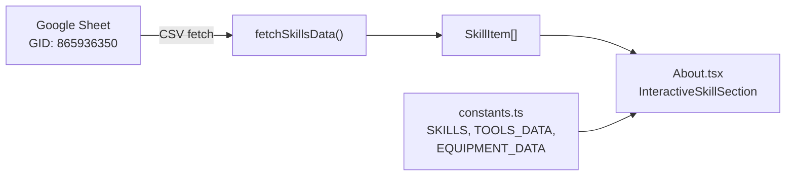
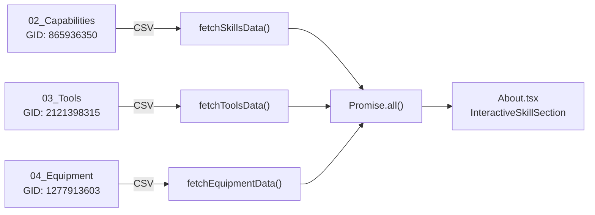
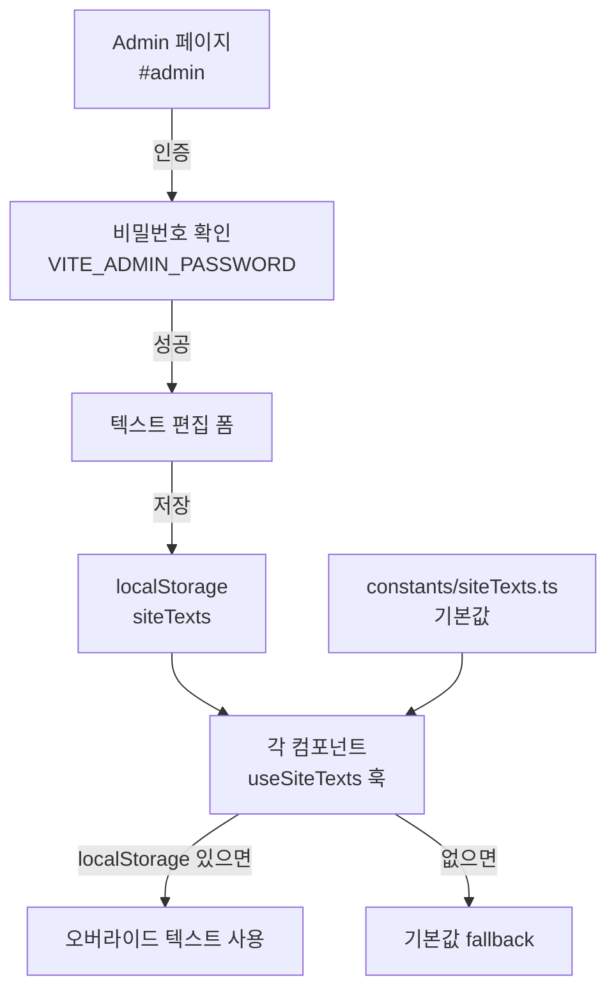

# About 섹션 수정 + 구글 폼 + Admin 페이지 구현 계획 v2.0

> **작성일**: 2026-02-10  
> **이전 버전**: `PLAN.md` (v1.0)  
> **적용 스킬**: `plan-writing`, `react-best-practices`, `frontend-dev-guidelines`, `interactive-portfolio`, `scroll-experience`

## Context

TWOONG STUDIO 포트폴리오 홈페이지의 About 섹션 데이터 소스를 3개 시트로 분리하고, 영상 촬영 문의 폼(구글 폼) 연동 및 사이트 텍스트 편집용 Admin 페이지를 추가합니다.

> [!IMPORTANT]
> 이 프로젝트는 **Vite + React + TypeScript + Tailwind** 기반 정적 사이트(Vercel 배포)입니다. Next.js가 아니므로 Suspense Query, Server Component 등은 적용 대상이 아닙니다.

---

## Part 1: About 섹션 — 3개 시트에서 데이터 로드

### 1-1. 현재 구조 분석



**현재 문제점**:
- `About.tsx`는 `constants.ts`의 **하드코딩 데이터**(`SKILLS`, `TOOLS_DATA`, `EQUIPMENT_DATA`)와 `fetchSkillsData()` **양쪽 모두** 사용 중
- `fetchSkillsData()`는 GID `865936350` (02_Capabilities 시트) 1개만 호출
- Tools/Equipment 시트 데이터는 아직 연동되지 않음

### 1-2. 변경 후 구조



### 1-3. 시트별 컬럼 매핑

| 시트 | GID | 원본 컬럼 | → 앱 내부 매핑 | 특이사항 |
|------|-----|-----------|---------------|---------|
| 02_Capabilities | `865936350` | category, filter, name, level, order, hidden | 그대로 유지 | 기존과 동일 |
| 03_Tools | `2121398315` | id, hidden, source_table, **group**, vendor, **tool_name**, **level**, remark | `group` → `filter`, `tool_name` → `name`, `category` = `'Tools'` | vendor는 UI에서 미사용 |
| 04_Equipment | `1277913603` | id, hidden, source_table, **group**, brand, **name**, **level**, remark | `group` → `filter`, `category` = `'Equipment'` | **level > 0인 항목만 표시** |

### 1-4. 수정 파일 상세

#### `services/googleSheetService.ts`

1. **상수 추가**:
   ```typescript
   const TOOLS_GID = '2121398315';
   const EQUIPMENT_GID = '1277913603';
   const GOOGLE_SHEET_TOOLS_URL = `${GOOGLE_SHEET_BASE_URL}?gid=${TOOLS_GID}&output=csv`;
   const GOOGLE_SHEET_EQUIPMENT_URL = `${GOOGLE_SHEET_BASE_URL}?gid=${EQUIPMENT_GID}&output=csv`;
   ```

2. **Raw 데이터 인터페이스 추가**:
   ```typescript
   interface ToolSheetRow {
     id: string;
     hidden: string;
     source_table: string;
     group: string;
     vendor: string;
     tool_name: string;
     level: string;
     remark: string;
   }

   interface EquipmentSheetRow {
     id: string;
     hidden: string;
     source_table: string;
     group: string;
     brand: string;
     name: string;
     level: string;
     remark: string;
   }
   ```

3. **`fetchToolsData()` 함수** — `SkillItem[]` 반환:
   - `group` → `filter`, `tool_name` → `name` 매핑
   - `category`는 `'Tools'`로 고정
   - `hidden !== 'TRUE'` 필터링
   - `react-best-practices` 스킬 적용: `async-parallel` — 기존 `fetchSkillsData()`와 동일한 PapaParse 패턴 사용
   - 에러 발생 시 빈 배열 반환 (graceful degradation)

4. **`fetchEquipmentData()` 함수** — `SkillItem[]` 반환:
   - `group` → `filter` 매핑
   - `category`는 `'Equipment'`로 고정
   - **`level > 0`인 항목만** 필터링 (level 0 = 비공개)
   - `hidden !== 'TRUE'` 필터링

#### `components/About.tsx`

1. **import 추가**: `fetchToolsData`, `fetchEquipmentData`
2. **`loadSkills()` 함수 수정**:
   - 현재: `fetchSkillsData()` 단독 호출 + `constants.ts` 하드코딩 데이터 병행
   - 변경: `Promise.all([fetchSkillsData(), fetchToolsData(), fetchEquipmentData()])` 병렬 호출
   - `react-best-practices` 스킬 적용: `async-parallel` 패턴으로 waterfall 제거
3. **`constants.ts` 하드코딩 데이터와의 관계 정리**:
   - 시트 데이터를 정상 로드하면 → 시트 데이터 사용
   - 시트 로드 실패 시 → `constants.ts`의 `SKILLS`, `TOOLS_DATA`, `EQUIPMENT_DATA`를 **fallback**으로 사용
   - `frontend-dev-guidelines` 스킬 적용: 에러 시 빈 배열이 아닌 fallback 데이터 제공으로 사용자 경험 향상

---

## Part 2: 구글 폼 (영상 촬영 문의)

### 2-1. 접근 방식
- Google Form은 **Google 대시보드에서 수동 생성** (코드 범위 밖)
- 코드에서는 폼 URL로 **새 탭 오픈**만 담당

### 2-2. 수정 파일 상세

#### `components/Contact.tsx`

1. **"촬영 문의하기" CTA 버튼 추가** (소셜 아이콘 영역 아래):
   ```tsx
   <a
     href={formUrl}
     target="_blank"
     rel="noopener noreferrer"
     className="inline-block mt-12 px-8 py-3 border border-slate-900 
                text-slate-900 text-xs tracking-[0.2em] uppercase 
                hover:bg-slate-900 hover:text-white 
                transition-all duration-500"
   >
     촬영 문의하기
   </a>
   ```
   - `interactive-portfolio` 스킬 적용: Contact 섹션은 **전환(Conversion)** 영역이므로 CTA를 명확히 배치
   - 스타일: 기존 `Home.tsx`의 "Explore Portfolio" 버튼과 동일한 미니멀 border 스타일
   - 호버 시 반전 효과 (배경: 검정, 텍스트: 흰색) — `scroll-experience` 스킬의 마이크로 인터랙션 원칙

2. **URL 관리**: 
   - 우선은 상수로 관리: `const FORM_URL = 'https://forms.google.com/...';`
   - Part 3(Admin)에서 `useSiteTexts` 훅 적용 시 동적 변경 가능하도록 구조화

---

## Part 3: Admin 페이지 — 사이트 텍스트 편집

### 3-1. 아키텍처 (Vercel 정적 배포 대응)



> [!WARNING]
> **localStorage 기반이므로 브라우저별/디바이스별 독립적**입니다. 다중 디바이스 동기화가 필요하면 향후 Firebase/Supabase 연동을 고려해야 합니다.

### 3-2. 신규 파일 상세

#### [NEW] `constants/siteTexts.ts`

```typescript
export interface SiteTextMap {
  [key: string]: string;
}

export const DEFAULT_SITE_TEXTS: SiteTextMap = {
  // Home 섹션
  'home.copy': '세상을 프레임 속에 담아내는 비디오 프로듀서',
  'home.cta': 'Explore Portfolio',
  
  // About 섹션
  'about.title': 'I AM A',
  'about.titleHighlight': 'STORYTELLER.',
  'about.quote': '카메라는 도구일 뿐, 진짜 이야기는 프레임 너머에 있습니다.',
  'about.description': '단순히 기록하는 것을 넘어, 감정과 메시지를 담은 영상을 만듭니다.',
  
  // Contact 섹션
  'contact.heading': 'CONTACT',
  'contact.subtext': '함께 새로운 프로젝트를 시작해볼까요?',
  'contact.formUrl': 'https://forms.google.com/...',
  'contact.formButtonText': '촬영 문의하기',
  'contact.location': 'Seoul, South Korea',
  'contact.availability': 'Available for worldwide projects',
  
  // Footer
  'footer.copyright': 'Video Producer',
};

export const SITE_TEXT_LABELS: SiteTextMap = {
  'home.copy': '홈 메인 카피',
  'home.cta': '홈 CTA 버튼 텍스트',
  'about.title': 'About 제목',
  'about.titleHighlight': 'About 강조 텍스트',
  'about.quote': 'About 인용구',
  'about.description': 'About 설명문',
  'contact.heading': 'Contact 헤딩',
  'contact.subtext': 'Contact 서브텍스트',
  'contact.formUrl': '촬영 문의 폼 URL',
  'contact.formButtonText': '촬영 문의 버튼 텍스트',
  'contact.location': '활동 지역',
  'contact.availability': '가용성 텍스트',
  'footer.copyright': '푸터 직함',
};
```

#### [NEW] `hooks/useSiteTexts.ts`

```typescript
import { useState, useCallback } from 'react';
import { DEFAULT_SITE_TEXTS, SiteTextMap } from '../constants/siteTexts';

const STORAGE_KEY = 'twoong_site_texts';

export function useSiteTexts() {
  // localStorage에서 저장된 텍스트를 읽어오고, 없으면 빈 객체 반환
  const getStoredTexts = (): Partial<SiteTextMap> => {
    try {
      const stored = localStorage.getItem(STORAGE_KEY);
      return stored ? JSON.parse(stored) : {};
    } catch {
      return {};
    }
  };

  const [texts, setTexts] = useState<Partial<SiteTextMap>>(getStoredTexts);

  // 단일 텍스트 조회 (localStorage 우선 → 기본값 fallback)
  const getSiteText = useCallback((key: string): string => {
    return texts[key] ?? DEFAULT_SITE_TEXTS[key] ?? '';
  }, [texts]);

  // 단일 텍스트 수정
  const setSiteText = useCallback((key: string, value: string) => {
    setTexts(prev => {
      const updated = { ...prev, [key]: value };
      localStorage.setItem(STORAGE_KEY, JSON.stringify(updated));
      return updated;
    });
  }, []);

  // 전체 텍스트 일괄 저장
  const saveAllTexts = useCallback((newTexts: Partial<SiteTextMap>) => {
    localStorage.setItem(STORAGE_KEY, JSON.stringify(newTexts));
    setTexts(newTexts);
  }, []);

  // 기본값으로 초기화
  const resetSiteTexts = useCallback(() => {
    localStorage.removeItem(STORAGE_KEY);
    setTexts({});
  }, []);

  return { getSiteText, setSiteText, saveAllTexts, resetSiteTexts, texts };
}
```

- `react-best-practices` 스킬 적용:
  - `useCallback`으로 핸들러 안정화 (`rerender-functional-setstate`)
  - `js-cache-storage` — localStorage 읽기를 초기화 시 1회만 수행

#### [NEW] `components/Admin.tsx`

**구조**:
1. **비밀번호 입력 화면** (미인증 상태)
   - `input[type="password"]` + 확인 버튼
   - `VITE_ADMIN_PASSWORD` 환경변수와 비교
   - 틀리면 인라인 에러 메시지 표시

2. **텍스트 편집 폼** (인증 후)
   - 섹션별 그룹핑: Home / About / Contact / Footer
   - 각 필드: `<label>` + `<textarea>` (기본값 placeholder 표시)
   - 저장 버튼: localStorage에 일괄 저장 + 성공 피드백 (인라인 메시지)
   - 초기화 버튼: localStorage 클리어 + 기본값 복원 확인 다이얼로그
   - 메인 페이지로 돌아가기 링크

3. **스타일**:
   - 기존 사이트와 일관된 미니멀 디자인 (Tailwind)
   - `font-sans`, 슬레이트 컬러 계열 유지

- `frontend-dev-guidelines` 스킬 적용: 
  - 컴포넌트 구조 순서 — Types → Hooks → Handlers → Render → Export
  - `React.lazy()` + Suspense로 레이지 로드

### 3-3. 라우팅

#### `App.tsx` 수정

```typescript
// Admin 레이지 로드
const Admin = lazy(() => import('./components/Admin'));

const App: React.FC = () => {
  const [isAdmin, setIsAdmin] = useState(false);

  useEffect(() => {
    // hash 기반 라우팅: #admin이면 Admin 모드
    const checkHash = () => setIsAdmin(window.location.hash === '#admin');
    checkHash();
    window.addEventListener('hashchange', checkHash);
    return () => window.removeEventListener('hashchange', checkHash);
  }, []);

  if (isAdmin) {
    return (
      <Suspense fallback={<SectionLoader />}>
        <Admin />
      </Suspense>
    );
  }

  return (
    // 기존 메인 페이지 렌더링 (변경 없음)
    ...
  );
};
```

### 3-4. 기존 컴포넌트 수정 (useSiteTexts 적용)

| 컴포넌트 | 변경 대상 텍스트 | 키 |
|----------|-----------------|-----|
| `Home.tsx` | 메인 카피 문장 | `home.copy` |
| `Home.tsx` | "Explore Portfolio" 버튼 | `home.cta` |
| `About.tsx` | "I AM A" 제목 | `about.title` |
| `About.tsx` | "STORYTELLER." 강조 | `about.titleHighlight` |
| `About.tsx` | 인용구 | `about.quote` |
| `About.tsx` | 설명문 | `about.description` |
| `Contact.tsx` | "CONTACT" 헤딩 | `contact.heading` |
| `Contact.tsx` | 서브텍스트 | `contact.subtext` |
| `Contact.tsx` | 촬영 문의 버튼 텍스트 | `contact.formButtonText` |
| `Contact.tsx` | 폼 URL | `contact.formUrl` |
| `Contact.tsx` | "Seoul, South Korea" | `contact.location` |
| `Contact.tsx` | "Available for…" | `contact.availability` |
| `App.tsx` | "Video Producer" (푸터) | `footer.copyright` |

**적용 패턴**:
```tsx
// Before (하드코딩)
<h2>CONTACT</h2>

// After (useSiteTexts)
const { getSiteText } = useSiteTexts();
<h2>{getSiteText('contact.heading')}</h2>
```

---

## Part 4: 시트 컬럼 동기화 + 모달 레이아웃 개선

### 4-0. 시트 컬럼 불일치 분석 🔴

> [!CAUTION]
> 시트 컬럼명이 변경되었으나 코드가 업데이트되지 않아 **일부 데이터가 누락**될 수 있습니다.

**실제 시트 헤더** (published CSV에서 확인):
```
id, date, hidden, participation_level, project_type, client, artist, 
running_time, title, contribution_rate, my_role, use_tools, set_up, 
video_url, description
```

**코드의 `SheetRow` vs 실제 시트 비교**:

| # | 코드 (`SheetRow`) | 실제 시트 컬럼 | 상태 | 영향 |
|---|------------------|---------------|------|------|
| 1 | `role` | `my_role` | ❌ **이름 불일치** | 모달에 역할(Role)이 표시 안 됨 |
| 2 | `edit_tool` | `use_tools` | ❌ **이름 불일치** | 현재 UI에서 미사용이라 당장 영향 없음 |
| 3 | `setup` | `set_up` | ❌ **이름 불일치** | setup 데이터 누락 |
| 4 | `thumbnail_url` | ❌ 시트에 없음 | ⚠️ **삭제된 컬럼** | `getYouTubeThumbnail()` fallback이 동작하므로 영향 제한적 |
| 5 | ❌ 코드에 없음 | `contribution_rate` | 🆕 **신규 컬럼** | 추가 필요 |
| 6 | ❌ 코드에 없음 | `client` | 🆕 **신규 컬럼** | 선택적 추가 |
| 7 | ❌ 코드에 없음 | `artist` | 🆕 **신규 컬럼** | 선택적 추가 |

**수정 필요 사항**:

```diff
 interface SheetRow {
     id: string;
     date: string;
+    hidden: string;
     participation_level: string;
     project_type: string;
+    client: string;
     artist: string;
     running_time: string;
     title: string;
-    role: string;
+    contribution_rate: string;
+    my_role: string;
+    use_tools: string;
-    video_url: string;
-    thumbnail_url: string;
-    edit_tool: string;
-    setup: string;
-    hidden: string;
+    set_up: string;
+    video_url: string;
     description: string;
 }
```

`fetchWorkItems()` 매핑도 함께 수정:
```diff
 .map(row => ({
     ...
-    role: row.role,
-    setup: row.setup,
+    role: row.my_role,
+    setup: row.set_up,
+    contributionRate: row.contribution_rate,
-    thumbnail: row.thumbnail_url || getYouTubeThumbnail(row.video_url),
+    thumbnail: getYouTubeThumbnail(row.video_url),
 }))
```

### 4-1. 모달 현재 구조

```
┌─────────────────────┐
│     영상 (상단)       │  ← max-w-xl, 세로 배치
├─────────────────────┤
│     내용 (하단)       │  ← 스크롤 가능
│  Category / Title    │
│  Role / Duration     │
│  Description         │
└─────────────────────┘
```

**문제점**: PC에서도 영상이 좁은 세로 모달 안에 갇혀 작게 보임

### 4-2. 변경 후 구조

**PC / 넓은 화면 (md 이상, 768px~)**: 가로형
```
┌──────────────────────┬──────────────────┐
│                      │  Category        │
│     영상 (좌측)       │  Title           │
│     aspect-video     │  Role + 참여율    │
│                      │  Duration/Release│
│                      │  Description     │
│                      │  CLOSE PROJECT   │
└──────────────────────┴──────────────────┘
          max-w-5xl (기존 xl → 5xl)
```

**모바일 / 좁은 화면 (md 미만)**: 기존 세로형 유지
```
┌─────────────────────┐
│     영상 (상단)       │
├─────────────────────┤
│     내용 (하단)       │
└─────────────────────┘
```

> 화면 너비에 따라 Tailwind의 `md:` 반응형 클래스로 자동 전환

### 4-3. contribution_rate (참여율) 추가

- 시트에 `contribution_rate` 컬럼이 **이미 존재** (예: `100%`, `60%`, `30%` 등)
- 모든 프로젝트에 값이 있으므로 필수 필드로 처리

| 변경 대상 | 내용 |
|----------|------|
| `types.ts` | `WorkItem`에 `contributionRate: string` 필드 추가 |
| `SheetRow` | `contribution_rate: string` (이미 시트에 존재) |
| `fetchWorkItems()` | `row.contribution_rate` → `contributionRate` 매핑 |
| `ProjectModal.tsx` | Role 아래에 참여율 표시 (예: `참여율 80%`) |

### 4-4. 수정 파일 상세

#### `services/googleSheetService.ts`

1. **`SheetRow` 인터페이스 수정**: 실제 시트 컬럼명에 맞게 동기화 (4-0의 diff 참고)
2. **`fetchWorkItems()` 매핑 수정**: `role` → `my_role`, `setup` → `set_up`, `thumbnail_url` 제거, `contribution_rate` 추가

#### `types.ts`

1. **`WorkItem`에 `contributionRate: string` 추가**

#### `components/ProjectModal.tsx`

1. **모달 너비 확대**: `max-w-xl` → `max-w-5xl` (PC)
2. **레이아웃 전환**: `md:flex-row` — PC에서 좌우 배치
   - 좌측: 영상 영역 (`md:w-3/5`)
   - 우측: 텍스트 영역 (`md:w-2/5`)
3. **모바일**: 기존 세로 배치 유지 (`flex-col`)
4. **Role 아래에 참여율 표시**: `contributionRate` 값을 배지 형태로 표시
5. **네비게이션 화살표 위치 조정**: 모달이 넓어지므로 `-left-16` → `-left-12` 등 조정

---

## 수정 대상 파일 요약

| 파일 | 변경 유형 | 변경 내용 | 예상 난이도 |
|------|----------|-----------|------------|
| `types.ts` | MODIFY | `WorkItem`에 `contributionRate?: string` 추가 | 🟢 |
| `services/googleSheetService.ts` | MODIFY | `SheetRow`에 `contribution_rate` + Tools/Equipment fetch 함수 추가 | 🟡 |
| `components/ProjectModal.tsx` | MODIFY | 가로형 레이아웃(md 이상) + 참여율 표시 | 🟠 |
| `components/About.tsx` | MODIFY | 3개 시트 `Promise.all` 병렬 fetch + fallback 로직 | 🟡 |
| `components/Contact.tsx` | MODIFY | "촬영 문의하기" CTA 버튼 + `useSiteTexts` 적용 | 🟢 |
| `components/Home.tsx` | MODIFY | `useSiteTexts` 적용 (메인 카피, CTA 버튼) | 🟢 |
| `constants/siteTexts.ts` | **NEW** | 기본 텍스트 정의 + 라벨 맵 | 🟢 |
| `hooks/useSiteTexts.ts` | **NEW** | localStorage 기반 텍스트 관리 훅 | 🟡 |
| `components/Admin.tsx` | **NEW** | 비밀번호 인증 + 텍스트 편집 폼 + 저장/초기화 | 🟠 |
| `App.tsx` | MODIFY | `#admin` hash 라우팅 분기 + Admin 레이지 로드 + 푸터 `useSiteTexts` | 🟡 |
| `.env.local` | MODIFY | `VITE_ADMIN_PASSWORD` 추가 | 🟢 |

---

## 검증 방법

### 자동 검증
1. **빌드 성공 확인**: `npm run build` — 에러 0개 확인
2. **TypeScript 타입 검사**: `npx tsc --noEmit` — 타입 에러 0개 확인

### 수동 브라우저 테스트 (`npm run dev` → localhost 접속)

| # | 테스트 | 기대 결과 | 확인 방법 |
|---|--------|----------|----------|
| 1 | About 섹션 데이터 로드 | 3개 카테고리(Capabilities/Tools/Equipment)의 탭이 각각 표시됨 | About 섹션 스크롤 후 탭 클릭하여 데이터 확인 |
| 2 | Equipment level=0 필터 | level 0인 장비 항목이 화면에 표시되지 않음 | Equipment 탭에서 항목 목록 확인 |
| 3 | 시트 fetch 실패 시 fallback | 네트워크 끊었을 때 `constants.ts` 하드코딩 데이터 표시 | DevTools → Network → Offline 모드 |
| 4 | 촬영 문의 버튼 | Contact 섹션 하단에 "촬영 문의하기" 버튼 표시 | 스크롤하여 Contact 섹션 확인 |
| 5 | 폼 링크 동작 | 버튼 클릭 시 새 탭에서 구글 폼 열림 | 버튼 클릭 후 새 탭 확인 |
| 6 | Admin 접속 | `/#admin` 입력 시 비밀번호 입력 화면 표시 | 주소창에 `/#admin` 입력 |
| 7 | Admin 인증 | 올바른 비밀번호 입력 시 텍스트 편집 폼 표시 | `.env.local`에 설정한 비밀번호 입력 |
| 8 | 텍스트 편집 → 반영 | Admin에서 텍스트 수정 후 저장 → 메인 페이지에서 변경된 텍스트 확인 | 저장 → `/#` 이동 → 변경 확인 |
| 9 | 초기화 기능 | 초기화 버튼 클릭 → 메인 페이지에서 기본 텍스트로 복원 | 초기화 → `/#` 이동 → 기본값 확인 |
| 10 | 잘못된 비밀번호 | 잘못된 비밀번호 입력 시 에러 메시지 표시 | 임의의 문자 입력 후 확인 |

---

## 향후 확장 고려사항 (Phase 5에 반영)

- **다중 디바이스 동기화**: localStorage → Firebase Realtime DB / Supabase로 마이그레이션 (`firebase` 스킬 참고)
- **다국어 지원**: `useSiteTexts`를 발전시켜 `react-i18next` 연동 가능 구조로 설계
- **스크롤 애니메이션 강화**: `scroll-experience` 스킬의 Framer Motion 패턴 적용 (About 패럴랙스, Work stagger)
- **포트폴리오 전환 최적화**: `interactive-portfolio` 스킬의 CTA 배치 원칙 (30초 테스트) 상시 점검
