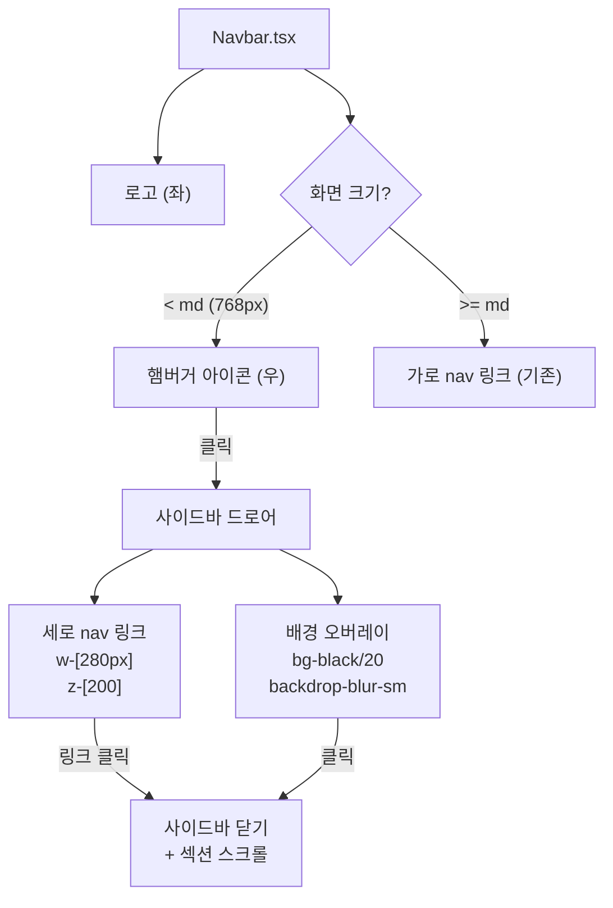
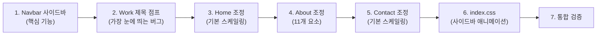

# 전체 UI 반응형 개선 구현 계획 v1.0

> **작성일**: 2026-02-13  
> **연관 문서**: `RESPONSIVE_UI.md`, `260210-PortfolioHomepage-Plan-v2.0.md`  
> **적용 스킬**: `ui-ux-pro-max`, `mobile-design`, `tailwind-patterns`

## Context

현재 포트폴리오 사이트는 `md`(768px) 하나의 브레이크포인트에만 의존하여, 모바일↔데스크탑 간 급격한 크기 점프가 발생합니다.

**핵심 문제 3가지**:
1. **모바일 네비게이션** — 좁은 화면에서 4개 링크(`HOME WORK ABOUT CONTACT`)가 `text-[10px]`으로 빽빽하게 나열됨
2. **Work 제목 점프** — `text-[20px] md:text-8xl` (20px→96px, **4.8배 점프**)는 중간 크기 화면에서 부자연스러움
3. **전반적 타이포그래피** — `sm:` 브레이크포인트를 전혀 활용하지 않아 640~767px 구간이 모바일 스타일 그대로 유지

> [!IMPORTANT]
> 이 프로젝트는 Tailwind CSS 기반이며, `tailwind-patterns` 스킬의 **Mobile-First Principle**을 따릅니다.
> 브레이크포인트: `sm:640px` → `md:768px` → `lg:1024px` → `xl:1280px`

---

## 적용 스킬 원칙 요약

### `ui-ux-pro-max` (CRITICAL)
- **`touch-target-size`** — 사이드바 링크 터치 타겟 최소 44×44px
- **`z-index-management`** — 사이드바 `z-[200]`, Navbar `z-[100]`으로 계층 유지
- **`readable-font-size`** — 모바일 본문 최소 16px
- **`duration-timing`** — 사이드바 전환 150~300ms
- **`transform-performance`** — 사이드바 애니메이션에 `transform` 사용 (GPU 가속)

### `mobile-design`
- **터치 타겟** — 모바일 링크 높이 48px+ 확보
- **드로어 패턴** — 모달 드로어(오른쪽 슬라이드, scrim 뒤) 적용
- **ESC/오버레이 닫기** — 모달 해제 3종 (X버튼, 오버레이 클릭, ESC키)
- **스크롤 잠금** — 사이드바 열릴 때 `body overflow-hidden`

### `tailwind-patterns`
- **Mobile-First** — prefix 없는 기본 스타일이 모바일, `sm:` `md:` `lg:` `xl:`로 점진적 확대
- **transition** — `transition-transform duration-300 ease-out` 패턴
- **z-index scale** — 10, 20, 30, 50, 100, 200 단위

---

## Part 1: Navbar 모바일 사이드바 메뉴

### 1-1. 현재 구조 분석

```
Navbar.tsx (98줄)
├── 상태: isScrolled, isHovered
├── 좌: 로고 "TWOONG STUDIO" (text-[15px] md:text-xl)
└── 우: navItems 가로 배열 (text-[10px] md:text-xs, space-x-3 md:space-x-12)
    └── 모바일에서도 가로 표시 → 빽빽함
```

### 1-2. 변경 후 구조



### 1-3. 상세 구현

#### [MODIFY] [Navbar.tsx](file:///c:/Users/BANG/Desktop/portfolio%20homepage%20PJT/components/Navbar.tsx)

1. **상태 추가**: `isSidebarOpen` → `useState(false)`
2. **햄버거 아이콘** (모바일 전용):
   - `md:hidden` — 데스크탑에서 숨김
   - SVG 아이콘 (3줄 → X 토글)
   - 터치 타겟: `w-10 h-10 flex items-center justify-center` (40px, `ui-ux-pro-max` 기준 준수)
3. **가로 nav 숨김** (모바일):
   - 기존 `<div className="flex space-x-3 md:space-x-12">` → `hidden md:flex md:space-x-12`
4. **사이드바 드로어**:
   - 위치: `fixed top-0 right-0 h-full w-[280px] z-[200]`
   - 배경: `bg-white`
   - 전환: `transform transition-transform duration-300 ease-out`
   - 열림: `translate-x-0`, 닫힘: `translate-x-full`
   - 내부: 세로 nav 링크, 각 링크 높이 `py-4` (48px+ 터치 타겟)
   - 활성 섹션: `border-l-2 border-slate-900`
   - 링크 클릭 시: `setIsSidebarOpen(false)` + `scrollToSection()`
5. **오버레이**:
   - `fixed inset-0 z-[199] bg-black/20 backdrop-blur-sm`
   - 클릭 시 사이드바 닫기
   - `transition-opacity duration-300`
6. **ESC키 닫기**: `useEffect` → `keydown` 이벤트 리스너
7. **스크롤 잠금**: `useEffect` → `isSidebarOpen` 변경 시 `document.body.style.overflow` 토글

#### [MODIFY] [index.css](file:///c:/Users/BANG/Desktop/portfolio%20homepage%20PJT/index.css)

```css
/* Sidebar Animation (CSS fallback) */
.sidebar-enter {
  animation: sidebarSlideIn 0.3s cubic-bezier(0.22, 1, 0.36, 1) forwards;
}

@keyframes sidebarSlideIn {
  from { transform: translateX(100%); }
  to { transform: translateX(0); }
}
```

> 실제 구현은 Tailwind의 인라인 `translate-x-*` 클래스를 우선 사용하되, CSS 애니메이션은 보조로 추가합니다.

---

## Part 2: Work 섹션 — 타이포그래피 단계적 스케일링

### 2-1. 문제 분석

| 요소 | 현재 | 점프 배율 | 문제 |
|------|------|----------|------|
| 제목 | `text-[20px] md:text-8xl` | 4.8배 (20→96px) | 640~767px에서 20px 유지 → 768px에서 갑자기 96px |
| 오버레이 제목 | `text-[12px] md:text-2xl` | 2.5배 | 중간 크기 없음 |
| 그리드 | `sm:grid-cols-2 lg:grid-cols-4` | — | `md:grid-cols-3` 누락 |

### 2-2. 변경 사항

#### [MODIFY] [Work.tsx](file:///c:/Users/BANG/Desktop/portfolio%20homepage%20PJT/components/Work.tsx)

| 요소 | 현재 | 변경 |
|------|------|------|
| **제목** | `text-[20px] md:text-8xl` | `text-3xl sm:text-4xl md:text-6xl lg:text-7xl xl:text-8xl` |
| 타입 필터 | `text-[10px] md:text-xs` | `text-[10px] sm:text-xs` |
| 카테고리 탭 | `text-[9px] md:text-[10px]` | `text-[10px] sm:text-xs` |
| 카테고리 패딩 | `px-3 py-1.5 md:px-4 md:py-2` | `px-3 py-1.5 sm:px-4 sm:py-2` |
| 오버레이 카테고리 | `text-[7px] md:text-[10px]` | `text-[8px] sm:text-[10px]` |
| 오버레이 제목 | `text-[12px] md:text-2xl` | `text-sm sm:text-base md:text-lg lg:text-2xl` |
| 그리드 | `sm:grid-cols-2 lg:grid-cols-4` | `sm:grid-cols-2 md:grid-cols-3 lg:grid-cols-4` |

---

## Part 3: Home 섹션 — 타이포그래피 & 레이아웃 조정

#### [MODIFY] [Home.tsx](file:///c:/Users/BANG/Desktop/portfolio%20homepage%20PJT/components/Home.tsx)

| 요소 | 현재 | 변경 |
|------|------|------|
| 설명 텍스트 | `text-lg md:text-2xl lg:text-3xl` | `text-base sm:text-lg md:text-xl lg:text-2xl xl:text-3xl` |
| CTA 버튼 텍스트 | `text-[10px] md:text-xs` | `text-xs md:text-sm` |
| CTA 버튼 패딩 | `px-10 py-4 md:px-12 md:py-5` | `px-8 py-3.5 sm:px-10 sm:py-4 md:px-12 md:py-5` |
| 스크롤 텍스트 | `text-[8px]` | `text-[10px] md:text-xs` |
| 뮤트 버튼 위치 | `bottom-12 right-12` | `bottom-6 right-6 md:bottom-12 md:right-12` |

---

## Part 4: About 섹션 — 타이포그래피 & 그리드 조정

#### [MODIFY] [About.tsx](file:///c:/Users/BANG/Desktop/portfolio%20homepage%20PJT/components/About.tsx)

| 요소 | 현재 | 변경 |
|------|------|------|
| 섹션 제목 | `text-3xl md:text-5xl` | `text-2xl sm:text-3xl md:text-4xl lg:text-5xl` |
| Storyteller | `text-5xl md:text-8xl lg:text-9xl` | `text-4xl sm:text-5xl md:text-7xl lg:text-8xl xl:text-9xl` |
| 인용구 | `text-lg md:text-2xl` | `text-base sm:text-lg md:text-xl lg:text-2xl` |
| 설명 | `text-sm md:text-lg` | `text-sm sm:text-base md:text-lg` |
| 스킬 그리드 | `grid-cols-1 lg:grid-cols-3` | `grid-cols-1 md:grid-cols-2 lg:grid-cols-3` |
| 스킬 헤더 | `text-xs md:text-sm` | `text-xs sm:text-sm` |
| 안내 텍스트 | `text-[9px] md:text-[10px]` | `text-[10px] sm:text-xs` |
| 필터명 | `text-[9px] md:text-base` | `text-xs sm:text-sm md:text-base` |
| Values 카드 제목 | `text-[11px] md:text-sm` | `text-xs sm:text-sm` |
| Values 카드 설명 | `text-[9px] md:text-xs` | `text-[10px] sm:text-xs` |
| Values 번호 | `text-[9px]` | `text-[10px]` |

---

## Part 5: Contact 섹션 — 타이포그래피 & 크기 조정

#### [MODIFY] [Contact.tsx](file:///c:/Users/BANG/Desktop/portfolio%20homepage%20PJT/components/Contact.tsx)

| 요소 | 현재 | 변경 |
|------|------|------|
| 섹션 제목 | `text-3xl md:text-5xl` | `text-2xl sm:text-3xl md:text-4xl lg:text-5xl` |
| 서브텍스트 | `text-xs md:text-sm` | `text-xs sm:text-sm` |
| 아이콘 크기 | `w-6 h-6 md:w-8 md:h-8` | `w-6 h-6 sm:w-7 sm:h-7 md:w-8 md:h-8` |
| 캘린더 높이 | `h-[400px] md:h-[500px]` | `h-[350px] sm:h-[400px] md:h-[500px]` |
| 캘린더 설명 | `text-[10px] md:text-xs` | `text-xs sm:text-sm` |
| CTA 텍스트 | `text-[10px] md:text-xs` | `text-xs sm:text-sm` |
| CTA 패딩 | `px-8 py-3 md:px-10 md:py-4` | `px-6 py-2.5 sm:px-8 sm:py-3 md:px-10 md:py-4` |
| 위치 텍스트 | `text-[10px] md:text-xs` | `text-[10px] sm:text-xs` |
| 가용성 | `text-[9px] md:text-[10px]` | `text-[10px] sm:text-xs` |

---

## Part 6: ProjectModal — 변경 없음

> `ProjectModal.tsx`는 이미 `md:max-w-[85vw] lg:max-w-[80vw] xl:max-w-7xl` 적용됨. 추가 변경 불필요.

---

## 수정 대상 파일 요약

| 파일 | 변경 유형 | 핵심 변경 | 예상 난이도 |
|------|----------|----------|-----------|
| `components/Navbar.tsx` | MODIFY | 사이드바 드로어, 햄버거 아이콘, ESC/오버레이 닫기 | 🟠 HIGH |
| `index.css` | MODIFY | 사이드바 슬라이드 애니메이션 keyframe 추가 | 🟢 LOW |
| `components/Work.tsx` | MODIFY | 제목/필터/그리드 단계적 스케일링 (클래스 값 교체) | 🟡 MEDIUM |
| `components/Home.tsx` | MODIFY | 텍스트/버튼/위치 단계적 스케일링 | 🟢 LOW |
| `components/About.tsx` | MODIFY | 제목/그리드/카드 단계적 스케일링 (11개 요소) | 🟡 MEDIUM |
| `components/Contact.tsx` | MODIFY | 제목/아이콘/캘린더/CTA 단계적 스케일링 | 🟢 LOW |

**신규 파일 없음** — 모든 변경은 기존 파일의 Tailwind 클래스 수정입니다.

---

## 구현 순서



---

## 검증 방법

### 자동 검증
1. **빌드 성공 확인**: `npm run build` — 에러 0개 확인
2. **TypeScript 타입 검사**: `npx tsc --noEmit` — 타입 에러 0개 확인

### 브라우저 반응형 테스트 (`npm run dev` → localhost)

| # | 뷰포트 | 테스트 항목 | 기대 결과 |
|---|--------|-----------|----------|
| 1 | **375px** (모바일) | Navbar | 햄버거 아이콘 표시, 가로 nav 숨김 |
| 2 | 375px | 사이드바 열기 | 햄버거 클릭 → 오른쪽에서 280px 드로어 슬라이드 인 |
| 3 | 375px | 오버레이 | 배경 반투명 + 블러 처리 |
| 4 | 375px | 사이드바 닫기 | 링크 클릭 / 오버레이 클릭 / ESC키 → 닫힘 |
| 5 | 375px | 스크롤 잠금 | 사이드바 열린 상태에서 배경 스크롤 불가 |
| 6 | 375px | Work 제목 | `text-3xl` (30px) — 기존 20px보다 자연스러운 크기 |
| 7 | **640px** (sm) | Navbar | 햄버거 아이콘 표시 (md 미만이므로) |
| 8 | 640px | Work 제목 | `text-4xl` (36px) — 중간 단계 |
| 9 | 640px | 그리드 | `sm:grid-cols-2` — 2열 유지 |
| 10 | **768px** (md) | Navbar | 가로 nav 링크 표시, 햄버거 숨김 |
| 11 | 768px | Work 제목 | `text-6xl` (60px) — 부드러운 전환 |
| 12 | 768px | Work 그리드 | `md:grid-cols-3` — 3열 |
| 13 | 768px | About 스킬 그리드 | `md:grid-cols-2` — 2열 |
| 14 | **1024px** (lg) | Work 제목 | `text-7xl` (72px) |
| 15 | 1024px | Work 그리드 | `lg:grid-cols-4` — 4열 |
| 16 | 1024px | About 스킬 그리드 | `lg:grid-cols-3` — 3열 |
| 17 | **1280px** (xl) | Work 제목 | `text-8xl` (96px) — 최종 크기(기존과 동일) |
| 18 | 전체 | 뮤트 버튼 | 모바일: `bottom-6 right-6`, PC: `bottom-12 right-12` |

### `ui-ux-pro-max` Pre-Delivery Checklist

- [ ] 사이드바 링크 터치 타겟 ≥ 44px
- [ ] 사이드바 `cursor-pointer` 적용
- [ ] 사이드바 transition 150~300ms 범위
- [ ] Focus states visible (키보드 내비게이션)
- [ ] 375px / 768px / 1024px / 1280px 에서 가로 스크롤 없음
- [ ] `prefers-reduced-motion` — 향후 고려 (Phase 5-C에서 적용)
